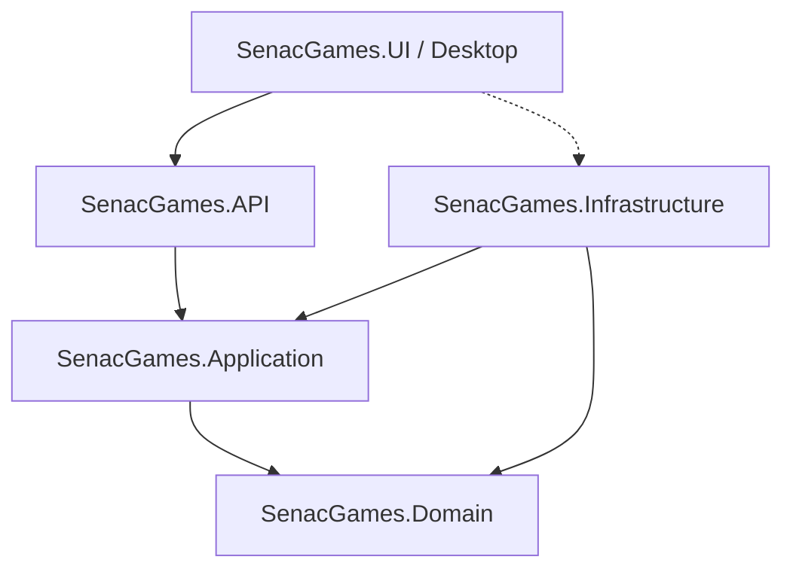
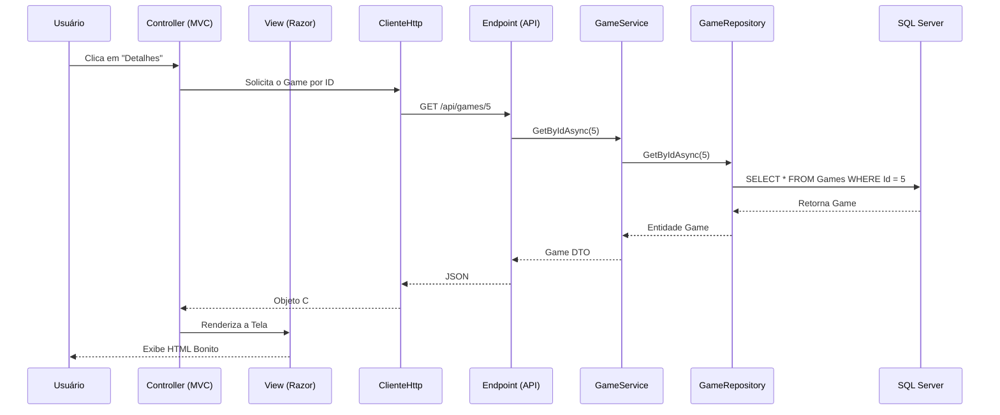

<!-- PAGE BREAK -->
<div style="text-align: center; margin-top: 100px;">
    <h1>🎮 SenacGames</h1>
    <h2>Guia Definitivo do Projeto</h2>
    <br/><br/>
    <p><b>Curso Técnico em Informática</b></p>
    <br/><br/>
    <p><i>Desenvolvido com:</i></p>
    <p>ASP.NET Core • Entity Framework Core • SQL Server • MVC • ASP.NET Identity</p>
</div>
<div style="page-break-after: always;"></div>

# SUMÁRIO
<!-- O índice será gerado automaticamente pelo PDF gerador -->

<div style="page-break-after: always;"></div>

# CAPÍTULO 1: O que é o SenacGames

Bem-vindo ao **SenacGames**! 

Você já imaginou como plataformas de distribuição de jogos, como a Steam ou a Epic Games, são desenvolvidas por trás das cortinas? O SenacGames é um projeto educacional projetado exatamente para responder a essa pergunta. 

O objetivo do projeto é ensinar você, aluno do Curso Técnico em Informática, a construir uma plataforma web moderna, robusta e segura, utilizando os padrões mais exigidos pelo mercado de trabalho corporativo.

> [!NOTE]
> **Objetivo do Projeto**
> Demonstrar o desenvolvimento de uma aplicação web completa (Full Stack) com controle de acesso, painéis de administração, APIs e consumo de dados utilizando boas práticas de arquitetura.

## Tecnologias Utilizadas

O ecossistema do SenacGames foi cuidadosamente escolhido para cobrir todas as frentes de uma aplicação corporativa C#. Eis o nosso cinto de utilidades:

- **Linguagem Principal:** C# (C-Sharp)
- **Framework:** .NET Core (ASP.NET Core para Web e API)
- **Banco de Dados:** Microsoft SQL Server
- **ORM (Object-Relational Mapper):** Entity Framework Core
- **Front-end / UI:** ASP.NET Core MVC com Razor Pages, Bootstrap 5 e CSS Customizado
- **Autenticação e Segurança:** ASP.NET Core Identity e JWT (JSON Web Tokens)
- **Arquitetura:** Onion Architecture (Arquitetura em Cebola) com separação em múltiplas camadas.

## Arquitetura Escolhida

Ao invés de misturar as telas (HTML), as regras do negócio e o acesso ao banco de dados num único local (o que chamamos de _Código Espaguete_), o SenacGames utiliza a **Arquitetura em Camadas**. 

### Benefícios dessa arquitetura:
1. **Manutenibilidade:** Se você precisar trocar a cor de um botão, não corre o risco de quebrar o login.
2. **Reaproveitamento:** A API pode ser usada tanto pelo painel Web quanto pelo aplicativo Desktop sem reescrever código.
3. **Trabalho em Equipe:** Enquanto um aluno faz o Banco de Dados, outro faz o Front-end sem que um bloqueie o outro.

***
<div style="page-break-after: always;"></div>

# CAPÍTULO 2: Arquitetura do Projeto

A grande "mágica" do SenacGames está na sua divisão estrutural. Pense no projeto como um restaurante: há o salão onde os clientes comem (Interface), os garçons (API/Controllers), o chef de cozinha (Service/Regras de negócio) e a despensa (Banco de Dados).

Aqui estão as camadas do projeto:



### 1. `SenacGames.Domain` (O Coração)
**Finalidade:** Contém as Entidades (Classes) que representam as tabelas do banco de dados (ex: `Game.cs`, `Category.cs`).
- **Responsabilidades:** Representar o domínio do negócio.
- **Quando utilizar:** Quando você precisar criar uma nova tabela, você criará uma classe aqui.

### 2. `SenacGames.Infrastructure` (A Despensa)
**Finalidade:** É a única camada que "conversa" de verdade com o SQL Server.
- **Responsabilidades:** Possui o `DbContext` do Entity Framework, as `Migrations` (histórico de alterações do banco) e as implementações de `Repository`.
- **Exemplos:** Aqui fica o código que faz os "INSERTs" e "SELECTs" reais.

### 3. `SenacGames.Application` (O Chef de Cozinha)
**Finalidade:** Contém as **Regras de Negócio** e os DTOs.
- **Responsabilidades:** Processar os dados. Por exemplo: "Um usuário só pode favoritar 10 games". É nesta camada que essa regra viverá (Service Pattern).
- **Quando utilizar:** Toda lógica complexa, validação ou orquestração deve estar aqui.

### 4. `SenacGames.API` (O Garçom)
**Finalidade:** É uma porta de entrada para aplicações externas.
- **Responsabilidades:** Fornecer rotas (Endpoints) como `/api/games` que retornam JSON.
- **Quando utilizar:** Quando um celular ou um programa Desktop quiser consultar a lista de games, ele chamará a API.

### 5. `SenacGames.UI` (O Salão de Clientes)
**Finalidade:** É a Interface do Usuário (Web) construída em **ASP.NET MVC**.
- **Responsabilidades:** Exibir o visual, carregar o CSS/Imagens (`wwwroot`) e desenhar as telas para o usuário final utilizando Razor (`.cshtml`).

### 6. `SenacGames.Desktop` (O Balcão Gerencial)
**Finalidade:** Um aplicativo Windows Forms para a administração do sistema.
- **Responsabilidades:** Fornecer telas nativas de Windows para gerenciar o catálogo consumindo a nossa API.

***
<div style="page-break-after: always;"></div>

# CAPÍTULO 3: Fluxo da Aplicação

Entender como um "clique" viaja pela aplicação é o segredo para se tornar um programador completo.

Veja o caminho de uma requisição típica quando o cliente quer ver os Detalhes de um Game na Loja Web:



### Passo a Passo Explicado:
1. **O Clique:** O usuário, no navegador, clica na capa de um game. O link vai para `GamesController.cs` no painel MVC.
2. **A Comunicação:** O MVC percebe que precisa dos dados do game, mas **ele não acessa o banco diretamente**. Ele pede para o serviço de API chamar a API.
3. **A API:** O `GamesController.cs` na API recebe o pedido `GET /api/games/5`. Ele repassa a tarefa para a camada de Aplicação (`GameService.cs`).
4. **Regras de Negócio:** O `Service` verifica se há alguma regra antes de entregar os dados.
5. **O Banco de Dados:** O `GameRepository` utiliza o **Entity Framework** para executar uma instrução SQL no banco.
6. **A Volta:** O banco retorna os dados. Esses dados passam pelo Repository, Service, API, convertem para JSON, chegam no MVC, que converte em HTML através da _View_ e devolve para a tela do usuário.

Esse caminho pode parecer longo, mas é o que garante que seu projeto não se torne um caos à medida que cresça!

***
<div style="page-break-after: always;"></div>

# CAPÍTULO 4: ASP.NET MVC

O ASP.NET Core MVC é a tecnologia responsável por criar a interface visual (a "cara") do SenacGames na Web. MVC significa **Model-View-Controller**. 

### 1. Model (O Dado)
No MVC, o *Model* representa a estrutura dos dados que vão para a tela. No SenacGames, usamos o padrão **ViewModel**, que é uma classe "ajustada" só com o que a tela precisa.
**Exemplo:** A tela de detalhes não precisa saber a senha do usuário que cadastrou o game, ela só precisa da classe `GameViewModel`.

### 2. View (A Tela)
A View é o HTML. No ASP.NET, usamos um motor chamado **Razor** (`.cshtml`). O Razor permite misturar C# com HTML!
Veja um exemplo real do projeto (`Details.cshtml`):
```html
@model SenacGames.UI.ViewModels.GameViewModel

<h1>@Model.Title</h1>
<p>@Model.Description</p>
```
O `@` indica que o que vem depois é código C#.

### 3. Controller (O Maestro)
O Controller é a classe C# (`Controller`) que recebe o clique do usuário, pede os dados e decide qual View mostrar.
```csharp
public async Task<IActionResult> Details(int id)
{
    var game = await _gameService.GetGameAsync(id);
    return View(game); // Manda o game para a tela
}
```

### Conceitos Importantes na MVC do SenacGames:

- **Model Binding:** É a mágica que pega o que o usuário digitou em `<input name="Title">` e converte automaticamente para um objeto `GameViewModel` no C#.
- **Partial View:** Pedaços de HTML reutilizáveis. 
- **Layouts:** O `_Layout.cshtml` é a "forma de bolo". Ele contém o cabeçalho e rodapé que se repetem em todas as páginas, para você não ter que copiar e colar o menu em cada tela nova.
- **Tag Helpers:** São extensões do ASP.NET para facilitar a escrita de HTML. Exemplo: `<a asp-controller="Home" asp-action="Index">` vira um link para a Home sem você precisar saber a URL exata.

***
<div style="page-break-after: always;"></div>

# CAPÍTULO 5: Entity Framework Core

O Entity Framework (EF) Core é o nosso ORM.

> [!TIP]
> **Analogia**
> O banco de dados (SQL) só entende tabelas e colunas. O C# só entende Classes e Propriedades. O EF Core é o "tradutor simultâneo" que pega suas classes em C# e transforma magicamente em comandos SQL.

### Componentes Chave:

- **Entities:** Suas classes de domínio (ex: `Game.cs`). Cada classe vira uma tabela. Cada propriedade vira uma coluna.
- **DbContext:** O `SenacGamesDbContext.cs` é o coração do EF. Ele gerencia a conexão com o banco e diz quais entidades vão virar tabelas.
- **DbSet:** Dentro do DbContext, temos `public DbSet<Game> Games { get; set; }`. Isso significa "Crie uma tabela chamada Games com base na classe Game".

### Trabalhando com o Banco de Dados

1. **LINQ:** Em vez de escrever `SELECT * FROM Games WHERE Title = 'Cyberpunk 2077'`, nós escrevemos em C# puro:
   ```csharp
   var games = _context.Games.Where(g => g.Title == "Cyberpunk 2077").ToList();
   ```
2. **Migrations:** Toda vez que você altera uma classe (ex: adiciona `public int ReleaseYear { get; set; }`), você usa `Add-Migration` e depois `Update-Database`. O EF cria o script SQL sozinho e altera o banco. Adeus criação manual de tabelas!
3. **Tracking vs NoTracking:** Quando você puxa um dado para editar, o EF fica "vigiando" (Tracking). Se você mudar uma propriedade, ele percebe e salva no banco. Se for só para exibir na tela, usamos `.AsNoTracking()` que é muito mais rápido porque o EF desativa esse "olheiro".
4. **Relacionamentos:** Para criar uma Chave Estrangeira, basta colocar um objeto dentro do outro. O EF entende que um `Game` tem uma `Category` e cria as FKs no SQL automaticamente.

***
<div style="page-break-after: always;"></div>

# CAPÍTULO 6: SQL Server

Mesmo usando o Entity Framework Core, o banco de dados real por baixo dos panos é o robusto **Microsoft SQL Server**.

### O Papel do SQL no Projeto
O EF gera as tabelas, as restrições (Constraints) e os relacionamentos, mas o SQL Server é quem armazena e processa isso em disco de forma otimizada.

**Onde o SQL entra em cena?**
- **Tabelas (Tables):** O EF transforma a classe `Game` na tabela `Games`.
- **Primary Keys (PK):** A propriedade `Id` nas suas classes automaticamente vira a Chave Primária, garantindo a unicidade de cada registro.
- **Foreign Keys (FK):** A propriedade `CategoryId` vira a Chave Estrangeira.
- **Índices:** O EF Core pode criar índices (para buscas mais rápidas) no banco SQL. No SenacGames, criamos índices em campos muito buscados, como o E-mail de usuário, para otimizar os acessos!

> [!WARNING]
> **Diferença entre EF e SQL**
> O EF é a ferramenta de programação. O SQL Server é o motor de armazenamento. Embora o EF facilite o trabalho, você deve entender de SQL para saber se as consultas geradas estão pesadas, se as chaves estrangeiras foram aplicadas corretamente e como otimizar o banco. No SenacGames, as Migrations são a ponte que converteu o modelo C# em instruções `CREATE TABLE` do SQL.

***
<div style="page-break-after: always;"></div>

# CAPÍTULO 7: ASP.NET Identity

A segurança é o pilar fundamental de qualquer aplicação corporativa. Quem é o usuário? Ele tem permissão para apagar um game?

O **ASP.NET Core Identity** é o porteiro do SenacGames. Ele nos poupou o trabalho de criar tabelas de login, hash de senhas e lógicas de recuperação complexas do zero.

### Componentes de Segurança do SenacGames

1. **Authentication (Autenticação):** Responde "QUEM é você?". Quando o usuário faz login, a API valida o email e a senha.
2. **Authorization (Autorização):** Responde "O QUE você pode fazer?". O usuário autenticado quer apagar um game. Ele é Administrador? Se for Cliente, acesso negado!
3. **Users e Password Hash:** O Identity nunca salva a senha pura (`"123456"`) no SQL. Ele gera um *Hash* irreversível. Se o banco vazar, os hackers não descobrirão a senha!
4. **Roles (Perfis):**
   - **Administrador:** Acesso total (cria games, gerencia usuários).
   - **Cliente:** Consumidor final.
5. **Claims (Afirmações):** São pedaços de informação sobre o usuário embutidos no token. Por exemplo: O nome do usuário e o caminho da foto de perfil. O SenacGames utiliza `Claim` para mostrar o nome sem ter que ir ao banco de dados toda vez!
6. **JWT (JSON Web Tokens):** A API, após confirmar o login, devolve um token JWT (uma credencial digital). O MVC e o Desktop guardam esse token. Em TODA requisição futura, eles enviam o JWT no cabeçalho.
7. **Cookies:** No painel Web (MVC), nós envelopamos esse JWT dentro de um Cookie criptografado. Assim, o navegador gerencia a sessão, garantindo login/logout de forma fluida.

***
<div style="page-break-after: always;"></div>

# CAPÍTULO 8: API REST

A API (Application Programming Interface) é o cérebro sem rosto do SenacGames. Ela não possui telas, não possui botões e não possui cores. Ela apenas recebe perguntas e responde com dados.

Nossa arquitetura usa a API como centro nervoso porque queremos servir múltiplas plataformas. A Loja Web consome a API. O Aplicativo Desktop consome a **mesma** API. Um futuro App Mobile consumiria a **mesma** API!

### O Que É Uma API REST?
REST é um conjunto de regras (boas práticas) de como conversar via Web. A conversa é baseada no padrão HTTP:

1. **Controllers e Endpoints:** 
   O `GamesController.cs` na API possui "Endpoints" (Portas lógicas). Cada Endpoint tem uma responsabilidade:
   - `GET /api/games`: Me dê todos os games (Ler).
   - `GET /api/games/5`: Me dê o game ID 5.
   - `POST /api/games`: Aqui estão os dados, CRIE um game (Criar).
   - `PUT /api/games/5`: Aqui estão os dados, ATUALIZE o game 5 (Editar).
   - `DELETE /api/games/5`: APAGUE o game 5.

2. **Status HTTP:**
   A API usa o vocabulário oficial da Web para responder:
   - `200 OK` (Deu tudo certo, aqui estão seus dados).
   - `400 BadRequest` (Você me enviou dados inválidos, corrija e tente de novo).
   - `401 Unauthorized` (Você precisa fazer login primeiro).
   - `403 Forbidden` (Você está logado, mas não tem permissão para isso).
   - `404 NotFound` (O game não existe).
   - `500 InternalServerError` (Algo explodiu no servidor).

3. **JSON:**
   Os dados transitam no formato JSON, uma linguagem universal que qualquer sistema entende:
   ```json
   {
       "id": 1,
       "title": "SenacGames: O Início",
       "releaseYear": 2024
   }
   ```

4. **Swagger:**
   Quando você roda a API no Visual Studio, uma tela preta e verde aparece. É o Swagger! Ele lê o seu código e monta um "Manual de Instruções" da API automaticamente, permitindo testar os endpoints sem precisar programar nada.

***
<div style="page-break-after: always;"></div>

# CAPÍTULO 9: Repository Pattern

### Por que existe e qual problema resolve?
Se você usar o `_context.Games.Add()` direto no `Controller` da API, você criou um problema grave: A API está intimamente "casada" com o Banco de Dados. Se um dia a equipe decidir trocar o SQL Server por MongoDB (ou Oracle), você terá que reescrever todos os Controllers.

O **Repository Pattern (Padrão de Repositório)** é um intermediário. Ele diz: "Não fale com o banco, fale comigo! Eu resolvo!". 

### O Fluxo Completo:
1. A API pede os dados ao `Service`.
2. O `Service` pede os dados ao `Repository`.
3. O `Repository` (e só ele) chama o Entity Framework.

### Exemplo no SenacGames:
Temos a Interface `IGameRepository` e a classe `GameRepository`.
```csharp
public async Task<Game> GetByIdAsync(int id)
{
    return await _context.Games
        .Include(g => g.Category)
        .FirstOrDefaultAsync(g => g.Id == id);
}
```
A API nem faz ideia de que o EF Core existe! Ela só sabe que chamou `GetByIdAsync` e a mágica aconteceu.

***
<div style="page-break-after: always;"></div>

# CAPÍTULO 10: Service Pattern

### Regras de Negócio e Validações
Onde colocamos a regra: "O usuário não pode cadastrar um game sem Category"? 
No Controller? **Não!** O Controller só serve para repassar recados.
No Repository? **Não!** O Repository só faz leitura/escrita no banco.

A lógica de negócios vai no **Service Pattern**! O Service é o cérebro da operação.

### Organização
Toda validação e orquestração fica aqui.
Se eu preciso deletar um game, o Service faz o seguinte:
1. Pede ao Repository para buscar o game.
2. Verifica se o game existe. (Se não, lança erro).
3. Pede ao Repository para deletar o game.

### Exemplo:
```csharp
public async Task AddAsync(GameDto dto)
{
    if (string.IsNullOrEmpty(dto.Title))
        throw new ArgumentException("O título é obrigatório");
        
    var game = new Game { Title = dto.Title };
    await _gameRepository.AddAsync(game);
}
```

***
<div style="page-break-after: always;"></div>

# CAPÍTULO 11: DTOs (Data Transfer Objects)

### Por que não enviar as "Entities" diretamente?
Imagine a classe `ApplicationUser`. Ela tem a propriedade `PasswordHash` (A senha criptografada).
Se a API retornar a classe `ApplicationUser` inteira num `GET /api/users`, o Frontend receberá o Hash da Senha de todos os usuários! Isso é um **Grave Vazamento de Dados de Segurança**!

### O Mapeamento (A Solução)
Criamos um **DTO (Objeto de Transferência de Dados)**. 
O DTO é uma classe "burra" e enxuta, feita **sob medida** para a tela.
Exemplo `AuthDto`:
```csharp
public class AuthDto
{
    public string Email { get; set; }
    public string Password { get; set; }
}
```

### Boas Práticas
- Entradas (`POST` / `PUT`) recebem DTOs (ex: `GameDto`).
- Saídas (`GET`) retornam DTOs (ex: `GameDto`).
- Apenas as camadas internas (Domain, Infra, Service) conhecem as Entidades reais. A API serve apenas os DTOs.

***
<div style="page-break-after: always;"></div>

# CAPÍTULO 12: AutoMapper

Se a API não pode retornar Entidades, e sim DTOs, como copiamos os dados de um para o outro?
A forma "braçal" é fazer isso:
```csharp
var dto = new GameDto();
dto.Title = game.Title;
dto.ReleaseYear = game.ReleaseYear;
// ... e fazer isso para várias propriedades!
```
### O Funcionamento
O **AutoMapper** (ou Mapster, ou outro mapeador automático) é uma biblioteca que faz isso magicamente.
Você cria um Perfil de Mapeamento:
```csharp
CreateMap<Game, GameDto>();
```
E então, no código, basta pedir ao Mapper para traduzir:
```csharp
var dto = _mapper.Map<GameDto>(game);
```
O AutoMapper olha as propriedades com o mesmo nome e tipo (ex: `Title` no Game e `Title` no DTO) e copia tudo sozinho, poupando milhares de linhas de código repetitivo e prevenindo erros humanos ("esqueci de copiar o Id!").

***
<div style="page-break-after: always;"></div>

# CAPÍTULO 13: Fluxo de Login

O login não é apenas verificar se a senha está certa. É gerar uma permissão que durará horas.

### O Diagrama Completo
```mermaid
graph TD
    User((Usuário)) -->|Digita E-mail e Senha| MVC[Login.cshtml]
    MVC -->|Envia Credenciais| AuthCliente[AuthApiService]
    AuthCliente -->|POST /api/auth/login| API[API - AuthController]
    API -->|Verifica Hash| Identity[Identity Service]
    Identity -->|Valida?| DB[(SQL Server)]
    Identity -->> API: Login Válido
    API -->|Gera Token JWT com Claims| API
    API -->> AuthCliente: Retorna JWT
    AuthCliente -->> MVC: Salva Token em um Cookie Seguro
    MVC -->> User: Redireciona para a Home Autenticada
```

Quando você clica em "Entrar", a MVC pede à API para validar as credenciais. A API invoca o Identity, que consulta o SQL. A senha está criptografada (hash), então o Identity recriptografa o que você digitou e compara as *hashes*. 
Estando tudo certo, a API assina um **JWT** (Token de acesso) e manda de volta para a Web MVC.
A Web MVC guarda esse token num Cookie para que o navegador se lembre de quem você é a cada clique nas páginas.

***
<div style="page-break-after: always;"></div>

# CAPÍTULO 14: Fluxo do Cadastro de Games

O administrador deseja adicionar um novo game no sistema. Veja o longo, porém organizado, caminho percorrido:

```mermaid
graph TD
    Admin((Administrador)) -->|Preenche Form| MVC[Games/Create]
    MVC -->|POST C#| GameCliente[GamesApiService]
    GameCliente -->|Anexa JWT no Cabeçalho HTTP| Request
    Request -->|POST /api/games| API[API - GamesController]
    API -->|Valida Autorização (Admin)| API
    API -->|GameDto| Service[GameService]
    Service -->|Aplica Regras de Negócio| Repo[GameRepository]
    Repo -->|EF Core .Add() / .SaveChanges()| SQL[(SQL Server)]
    SQL -->> Repo: Game Inserido com Novo ID
    Repo -->> Service: Game Entidade
    Service -->> API: Sucesso (HTTP 201 Created)
    API -->> GameCliente: JSON
    GameCliente -->> MVC: Redireciona para Lista de Games
```

Este fluxo demonstra a segurança profunda: Mesmo que um "hacker" tente enviar o comando via Postman, a etapa de **Valida Autorização** barrará a execução caso o JWT não contenha o perfil "Administrador".

***
<div style="page-break-after: always;"></div>

# CAPÍTULO 15: Estrutura das Pastas

Para manter a sanidade mental de uma equipe de programação, o código precisa ter um "lugar para cada coisa, e cada coisa em seu lugar". No SenacGames temos a seguinte estrutura base:

```text
SenacGames/
├── SenacGames.Domain/
│   └── Entities (Game.cs, Category.cs)
├── SenacGames.Infrastructure/
│   ├── Context/ (SenacGamesDbContext.cs)
│   ├── Migrations/ (Arquivos gerados pelo EF Core)
│   └── Repositories/ (Implementações do banco, ex: GameRepository.cs)
├── SenacGames.Application/
│   ├── DTOs/ (GameDto.cs, AuthDto.cs)
│   └── Services/ (GameService.cs, CategoryService.cs)
├── SenacGames.API/
│   ├── Controllers/ (GamesController.cs, AuthController.cs)
│   └── Program.cs (Onde ligamos todas as Injeções de Dependência)
├── SenacGames.UI/
│   ├── Controllers/ (Painel Web - GamesController.cs)
│   ├── Views/ (HTML - Home/Index.cshtml)
│   └── wwwroot/ (CSS, JS, Imagens, Uploads)
├── SenacGames.Desktop/
│   ├── Forms/ (Telas WinForms)
│   └── Services/ (Classes que consomem a API, ex: GamesApiService.cs)
└── Docs/
    └── Documentação oficial (Este arquivo inclusive)
```

- **`wwwroot`**: Essa pasta no projeto MVC é especial. Ela é a **única** pasta que o navegador do usuário final consegue acessar (onde ficam as imagens e folhas de estilo CSS públicas).
- **`Program.cs`**: É o "botão de ligar" do sistema. Lá nós configuramos o Banco de Dados, o Identity, o Swagger e registramos nossos Services.

***
<div style="page-break-after: always;"></div>

# CAPÍTULO 16: Migrations

Lembra de quando você fazia Banco de Dados no primeiro módulo e tinha que guardar um arquivo `script.sql` para rodar na máquina do colega?
As **Migrations** do Entity Framework eliminam esse trabalho manual. Elas são o "Controle de Versão" do Banco de Dados.

### 1. `Add-Migration NomeDaMudanca`
Quando você cria uma classe nova ou altera uma propriedade, você abre o "Package Manager Console" e digita esse comando.
O EF vai comparar as suas Classes com o Banco atual e vai gerar um arquivo C# na pasta `Migrations` com as instruções (UP: "Crie a coluna" e DOWN: "Remova a coluna").

### 2. `Update-Database`
Este comando pega todas as Migrations que o seu banco local ainda não tem e aplica-as fisicamente no SQL Server. Ele envia os `ALTER TABLE` e `CREATE TABLE`!

***
<div style="page-break-after: always;"></div>

# CAPÍTULO 17: Boas Práticas

O código funciona, mas ele tem qualidade? O SenacGames utiliza boas práticas globais.

### 1. Injeção de Dependência (DI)
Em vez de instanciar classes com `new GameRepository()`, nós injetamos.
```csharp
public class GamesController
{
    private readonly IGameService _service;
    public GamesController(IGameService service) { _service = service; }
}
```
Isso permite que a configuração no `Program.cs` passe a instância certa e ajuda a criar Testes de Software.

### 2. SOLID (S = Single Responsibility Principle)
Cada classe deve ter apenas um motivo para mudar. 
- O Controller só liga para rotas (MVC).
- O Service só liga para regras de negócios.
- O Repository só liga para o Banco. 

Se der erro no banco, você sabe exatamente qual classe abriu (e não precisa caçar no meio do HTML).

### 3. Clean Code (Código Limpo)
Utilizamos nomes em inglês técnicos (`GetByIdAsync`, `GamesController`) para padronizar com as ferramentas globais. Métodos curtos, classes bem definidas e separadas em pastas categóricas.

### 4. Retornos Assíncronos (`async/await`)
Toda chamada que envolve internet, leitura de disco ou banco de dados no SenacGames utiliza `Task` e `async/await`. Isso significa que o servidor (IIS/Kestrel) não vai "travar" a thread enquanto espera a resposta do Banco de Dados. O sistema fica milhares de vezes mais rápido para atender dezenas de usuários simultâneos!

***
<div style="page-break-after: always;"></div>

# CAPÍTULO 18: Exercícios

Chegou a hora de você sujar as mãos com o código! Para testar seus conhecimentos e mergulhar fundo no SenacGames, sugerimos as seguintes tarefas:

1. **Adicionar o CRUD de Avaliações/Reviews:**
   - Crie a entidade `Review.cs` em `Domain`.
   - Adicione no `SenacGamesDbContext` e crie a Migration.
   - Crie o `ReviewRepository` e a API.
   - Implemente uma tela na MVC para visualizar Avaliações de um Game.

2. **Adicionar nova Role (Perfil):**
   - Acesse a configuração de autorização no projeto.
   - Adicione a Role `Support`.
   - No Controller, limite uma rota apenas para o Suporte usando o atributo `[Authorize(Roles="Support")]`.

3. **Criar um Relatório no Aplicativo Desktop:**
   - Adicione uma aba "Relatórios".
   - Crie um botão para buscar todos os Games e exibir numa Tabela (`DataGridView`).
   - Você precisará consumir o `GamesApiService.cs` e montar a Grid.

***
<div style="page-break-after: always;"></div>

# CAPÍTULO 19: Perguntas Frequentes (FAQ)

**1. Por que usar Repository Pattern e não colocar o `_context` na API direto?**
Para manter a sua API limpa e independente. Se amanhã o sistema trocar o tipo de banco de dados, você troca apenas o Repository, e toda a API e UI continuam funcionando intactas. Além disso, permite Testes Unitários de forma mais fácil.

**2. Por que usar DTOs em vez de retornar as classes originais do EF?**
Por segurança! A classe do EF possui amarras do banco e dados sensíveis. O DTO é uma caixa de transporte apenas com o estritamente necessário.

**3. Quando utilizar SQL Puro?**
O EF Core é excelente para 95% do sistema (CRUD, buscas, relatórios simples). Para consultas de milhões de registros, geração de planilhas complexas com diversos JOINs pesados, usar um `Stored Procedure` no SQL puro pode ser mais otimizado.

**4. Por que usar Identity? Não posso apenas salvar senha e logar?**
O Identity faz o hash moderno das senhas (nunca se salva senha crua!), cuida da expiração do JWT, protege contra ataques básicos, trata os perfis (Roles) de forma padronizada para toda a plataforma Microsoft, e gerencia tokens de recuperação. Construir isso do zero hoje é correr um risco extremo de segurança.

***
<div style="page-break-after: always;"></div>

# CAPÍTULO 20: Glossário Técnico

- **ORM (Object-Relational Mapping):** Ferramenta (como o EF Core) que traduz código C# em SQL e vice-versa.
- **Migration:** Arquivo de código que registra as mudanças (criações/alterações) do Banco de Dados para que ele evolua junto com as classes C#.
- **Claim:** É um pedaço de informação de identidade "costurado" no passaporte (token JWT) do usuário. 
- **Hash:** Transformação matemática irreversível de uma string. Uma senha `"123"` vira um Hash gigantesco. Nunca mais se reverte, só se compara.
- **JWT (JSON Web Token):** Um token de sessão em formato JSON, assinado digitalmente, que prova que o usuário logou recentemente. O usuário envia no "Header" da requisição.
- **Middleware:** São "tubos" pelo qual a requisição passa antes de chegar na API (Ex: O Middleware de Autorização intercepta a requisição e expulsa quem não tem o JWT).
- **Endpoint:** Uma URL da sua API disponível para chamadas (Ex: `GET /api/games/1`).
- **LINQ (Language Integrated Query):** Sintaxe C# super poderosa para filtrar dados em Listas (`.Where(x => ...)`) que o EF converte diretamente em linguagem SQL.
- **Razor:** Motor de visualização da Microsoft que permite misturar C# (`@foreach`, `@if`) com código HTML.
- **Seed (Semente):** Injeção de dados automáticos durante a primeira inicialização (carga inicial) do banco de dados para evitar que ele inicie vazio.

<br/><br/>
> [!NOTE]
> Parabéns por concluir o Guia do SenacGames! Estudar essa aplicação te colocará vários passos à frente em arquiteturas modernas. Mãos à obra e sucesso!
